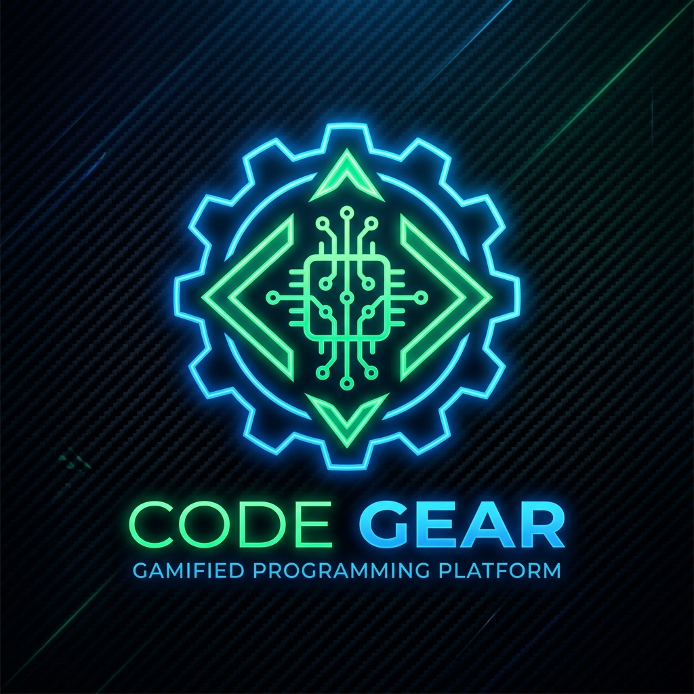

# ⚡ Code Gear — Gamified Programming Engine

<div align="center">
  
</div>

Welcome to **Code Gear**. This is a highly interactive, Next.js-powered educational platform designed to teach programming through a gamified, LeetCode-style curriculum. 

Ditching the traditional "boring IDE", Code Gear provides an engaging Campaign Map, persistent XP tracking, and dynamic problem-solving missions that auto-advance as you write correct code.

## ✨ Features
- **🎮 Campaign Map:** A visual, Candy Crush-style progression map that unlocks new levels as you master programming concepts.
- **🏆 Persistent XP & Gamification:** Earn XP for every mission passed. Your progress is permanently saved using a local SQLite Database via Prisma.
- **🤖 Auto-Validation Engine:** Writes to standard output are automatically intercepted and checked against mission requirements (similar to LeetCode).
- **☁️ Cloud Execution:** Connects directly to the Wandbox public API, allowing serverless C, C++, and Java execution directly from the browser!
- **🔐 Google OAuth:** Secure user login via NextAuth.

---

## 🚀 How to Clone and Run Locally

Follow these steps to set up the game engine on your local machine.

### 1. Clone the Repository
Open your terminal and clone the repository:
```bash
git clone https://github.com/Sahil1205-jat/codegear-wirefrontend.git
cd codegear-wirefrontend
```

### 2. Install Dependencies
Install all the required Node.js packages:
```bash
npm install
```

### 3. Configure Environment Variables
You need to set up your Google OAuth keys and Database URL.
Create a new file named `.env.local` in the root of the frontend folder and add the following:

```env
# Google OAuth Credentials
GOOGLE_CLIENT_ID="your_google_client_id_here"
GOOGLE_CLIENT_SECRET="your_google_client_secret_here"
NEXTAUTH_SECRET="any_random_string_like_codegear123"
NEXTAUTH_URL="http://localhost:3000"

# Local Database
DATABASE_URL="file:./dev.db"
```

### 4. Initialize the Database
The platform uses Prisma and SQLite to save user progress. Run the following commands to generate the local database file:
```bash
npx prisma db push
npx prisma generate
```
*(This will automatically create a `dev.db` file in your `/prisma` folder.)*

### 5. Start the Game Engine!
Boot up the Next.js development server:
```bash
npm run dev
```
Open [http://localhost:3000](http://localhost:3000) in your browser. Log in with Google, and start coding!

---

## 🛠️ Tech Stack
- **Framework:** Next.js 15 (App Router)
- **Database:** Prisma ORM + SQLite
- **Authentication:** NextAuth (Google Provider)
- **Styling:** Tailwind CSS + Framer Motion
- **Icons:** Lucide React
